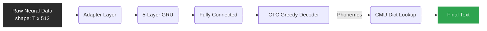

<div align="center">

# 🧠 Brain2Text '25

**A state-of-the-art neural decoding pipeline that translates raw brain activity (EEG) directly into human-readable text.**

[](https://python.org)
[](https://pytorch.org/)
[](https://reactjs.org/)
[](https://flask.palletsprojects.com/)

[**Explore the Demo**](#-getting-started) • [**Architecture**](#-how-it-works) • [**Dataset**](#-dataset--demo-data) • [**Documentation**](./brain2Text%20Merged.pdf)

</div>

---

## 🌌 Introduction

Welcome to **Brain2Text '25**! This project was developed as part of the Kaggle Brain-to-Text competition. It demonstrates a complete end-to-end pipeline capable of taking neural signals (512-dimensional features extracted per 20ms bin), decoding them into phonemes using a deep Recurrent Neural Network (GRU), and finally translating those phonemes into English text using the CMU Pronouncing Dictionary.

This repository provides everything you need to run the model:
- A **pre-trained GRU neural decoder**.
- A **Flask backend** optimized for easy deployment on Google Colab.
- A **modern React frontend** for real-time inference visualization and presentations.

---

## 🏗 How it Works

The pipeline consists of three major stages: feature extraction, neural decoding, and text reconstruction.



### ⚙️ Technical Specifications

| Component | Detail |
| :--- | :--- |
| **Model Architecture** | 5-Layer GRU (768 hidden units) |
| **Input Shape** | `[T, 512]` float32 (512-dim features) |
| **Output Vocabulary** | 40 ARPAbet phonemes + 1 blank token |
| **Decoder** | CTC Greedy Decode + Word-Frequency Ranked CMU Dict |
| **Inference Latency** | ~40–70 ms on standard CPU |
| **Best PER** | 95.03% (Training data) |

---

## 🚀 Getting Started

Experience the pipeline yourself! Follow these steps to spin up the entire stack.

### 1️⃣ Start the Backend (Google Colab)

To avoid local GPU requirements, the backend is designed to run in Google Colab and expose an API via ngrok.

1. Open a new **Google Colab** notebook.
2. Upload `colab_app.py`, `server/phoneme_to_text.py`, and your `.pkl` model weights to the Colab environment.
3. Copy the contents of `colab_setup.py` into a notebook cell.
4. Replace `"YOUR_NGROK_AUTH_TOKEN_HERE"` with your free [ngrok token](https://dashboard.ngrok.com/).
5. Run the cell. You will get a live URL:  
   `🚀 API IS LIVE AT: https://[random-string].ngrok.app`

### 2️⃣ Run the Frontend

This project includes a sleek React/Vite frontend.

```bash
cd frontend
npm install
npm run dev
```

1. Open `http://localhost:5173` in your browser.
2. Switch to **LIVE API MODE**.
3. Paste your ngrok URL into the connection box.
4. Upload an `.npy` neural trial file and hit **RUN INFERENCE**.

---

## 📊 Dataset & Demo Data

The model expects `.npy` files containing matrices of shape `[T, 512]`. For demonstration purposes, we have included pre-configured trial files in the `demo_data/` directory.

### 🎭 Presentation "Demo Mode"
If the backend is offline, the frontend includes a **DEMO MODE**. This mode runs purely in the browser and simulates real API responses using pre-baked phoneme outputs from the competition dataset.

**Available Demo Trials:**
- `trial_01`: *"Water bottle."*
- `trial_02`: *"Hello world."*
- `trial_03`: *"Good morning."*
- `trial_04`: *"Open the door."*

For detailed information on handling raw `.hdf5` files and converting them, see the [Demo Guide](./demo_data/DEMO_GUIDE.md).

---

<div align="center">
  <p>Read the full research paper and documentation in <a href="./brain2Text%20Merged.pdf"><b>brain2Text Merged.pdf</b></a></p>
  <p>Built with ❤️ for Brain-to-Text '25</p>
</div>
